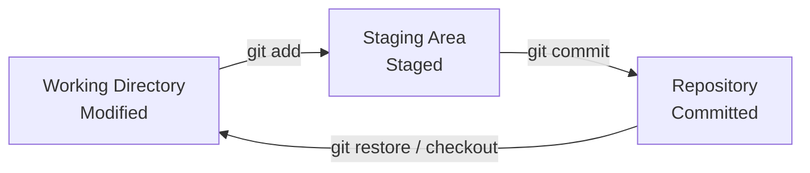
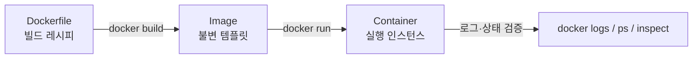
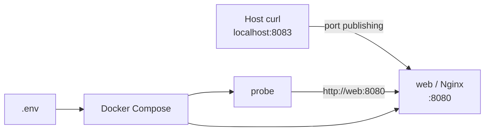
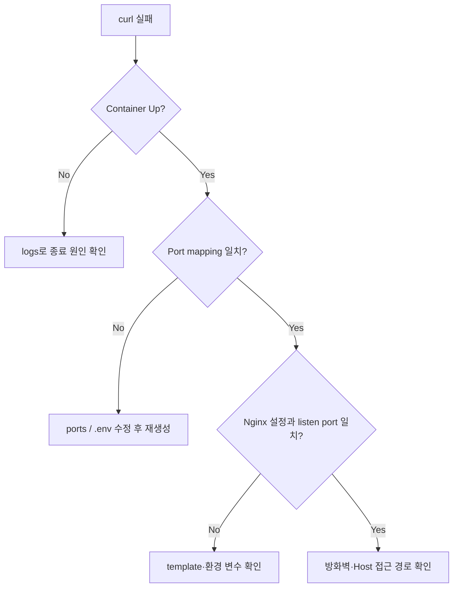

# E1-1 개발 환경 실습 가이드

이 문서는 Linux CLI, Git/GitHub, Docker, Docker Compose 실습에서 사용한 개념과 명령어, 검증 기준, 트러블슈팅 과정을 정리한 학습용 Wiki 원문입니다.

> 실습 이미지는 저장소의 `docs/images/`에서 관리합니다. 파일을 추가한 뒤 아래 주석 처리된 이미지 문법을 해제하면 Wiki 게시본에서도 동일한 캡처를 사용할 수 있습니다.

## 목차

1. [버전 관리와 Git](#1-버전-관리와-git)
2. [Linux CLI와 파일 권한](#2-linux-cli와-파일-권한)
3. [Docker 핵심 개념](#3-docker-핵심-개념)
4. [이미지와 컨테이너 실습](#4-이미지와-컨테이너-실습)
5. [Dockerfile과 Nginx 웹 서버](#5-dockerfile과-nginx-웹-서버)
6. [Bind Mount와 Volume](#6-bind-mount와-volume)
7. [Docker Compose](#7-docker-compose)
8. [환경 변수 기반 멀티 컨테이너](#8-환경-변수-기반-멀티-컨테이너)
9. [GitHub SSH 인증](#9-github-ssh-인증)
10. [트러블슈팅](#10-트러블슈팅)

## 1. 버전 관리와 Git

### 1.1 버전 관리 시스템

버전 관리 시스템(VCS)은 파일의 변화를 시간순으로 기록하고 특정 시점의 상태를 복원하는 도구입니다.

| 구분 | 저장 방식 | 장점 | 한계 |
| --- | --- | --- | --- |
| Local VCS | 로컬 DB에 변경 이력 저장 | 단순하고 빠름 | 장비 장애와 협업에 취약 |
| Centralized VCS | 중앙 서버가 이력을 관리 | 권한·협업 관리가 쉬움 | 중앙 서버가 단일 장애점 |
| Distributed VCS | 각 클라이언트가 전체 저장소 복제 | 오프라인 작업과 복구에 강함 | 저장소·브랜치 운용 규칙 필요 |

Git은 Distributed VCS이며 파일 차이만 나열하기보다 프로젝트의 스냅샷을 연결해 관리합니다. 객체는 해시로 식별되므로 저장된 데이터의 무결성을 확인할 수 있습니다.

### 1.2 Git의 세 가지 상태



| 상태 | 의미 | 확인 명령 |
| --- | --- | --- |
| Modified | 작업 트리에서 파일이 변경됨 | `git status` |
| Staged | 다음 커밋에 포함될 스냅샷 후보 | `git diff --staged` |
| Committed | 로컬 저장소에 스냅샷 저장 완료 | `git log` |

### 1.3 초기 설정과 저장소 연결

> 📸 **Git과 GitHub SSH 검증:** `docs/images/03-git-ssh.png`

<!--  -->

```bash
# 한 컴퓨터에서 최초 1회 설정
git config --global user.name "<name>"
git config --global user.email "<email>"
git config --global init.defaultBranch main

# 설정 확인
git config --list

# 저장소 초기화 및 첫 push
git init
git add README.md
git commit -m "first commit"
git branch -M main
git remote add origin git@github.com:yhana972/Codyssey_E1-1.git
git push -u origin main
```

| 명령 | 역할 |
| --- | --- |
| `git init` | 현재 디렉터리에 `.git` 저장소 생성 |
| `git add <path>` | 변경 내용을 Staging Area에 등록 |
| `git commit -m` | Staged snapshot을 로컬 저장소에 기록 |
| `git remote add` | 원격 저장소 별칭과 URL 등록 |
| `git push -u` | 커밋 전송 및 upstream branch 설정 |

## 2. Linux CLI와 파일 권한

> 📸 **기본 명령어:** `docs/images/01-linux-cli.png`
>
> 📸 **권한 변경 전·후:** `docs/images/02-linux-permission.png`

<!--  -->
<!--  -->

### 2.1 경로와 파일 조작

```bash
# 현재 위치와 숨김 항목을 포함한 상세 목록
pwd
ls -al

# 생성
touch test.txt
mkdir test

# 복사: 디렉터리는 -r 필요
cp test.txt copy.txt
cp -r test copied-test

# 이동과 이름 변경은 모두 mv 사용
mv copy.txt test/
mv test.txt renamed.txt

# 내용 확인과 편집
cat renamed.txt
vim renamed.txt

# 삭제 전 경로를 반드시 재확인
rm renamed.txt
rm -r copied-test
```

| 명령/옵션 | 의미 | 주의점 |
| --- | --- | --- |
| `pwd` | 현재 디렉터리의 절대 경로 출력 | 스크립트 실행 전 위치 확인에 유용 |
| `ls -a` | 숨김 항목 포함 | `.`과 `..`도 출력 |
| `ls -l` | 권한·소유자·크기·시간 출력 | 권한 변경 전후 비교에 사용 |
| `cp -r` | 하위 항목을 재귀적으로 복사 | 대상 경로를 먼저 확인 |
| `mv` | 이동 또는 이름 변경 | 같은 이름이 있으면 덮어쓸 수 있음 |
| `rm -r` | 디렉터리를 재귀 삭제 | 휴지통을 거치지 않으므로 특히 주의 |

### 2.2 절대 경로와 상대 경로

| 경로 | 기준 | 예시 |
| --- | --- | --- |
| 절대 경로 | 파일 시스템 루트 `/` | `/Users/user/Codyssey` |
| 상대 경로 | 현재 작업 디렉터리 | `./app`, `../README.md` |
| 홈 경로 | 현재 사용자 홈 | `~/.ssh` |

```bash
cd /Users/user/Codyssey # 절대 경로
cd ./docker-web         # 현재 위치 기준
cd ..                   # 상위 디렉터리
cd -                    # 직전 작업 디렉터리
cd ~                    # 사용자 홈
```

### 2.3 파일 권한

`ls -l`의 첫 필드는 파일 종류와 `user/group/others`의 권한을 표시합니다.

```text
- rwx rwx rwx
│  │   │   └─ others
│  │   └───── group
│  └───────── user
└──────────── file type (-: file, d: directory)
```

| 권한 | 숫자 | 파일 | 디렉터리 |
| --- | ---: | --- | --- |
| `r` | 4 | 내용 읽기 | 항목 목록 읽기 |
| `w` | 2 | 내용 수정 | 항목 생성·삭제 |
| `x` | 1 | 실행 | 디렉터리 진입 |

```bash
# 디렉터리: 755 → 700
ls -ld Codyssey
chmod 700 Codyssey
ls -ld Codyssey

# 파일: 644 → 777
ls -l Codyssey/new.txt
chmod 777 Codyssey/new.txt
ls -l Codyssey/new.txt
```

> 실습에서는 `777`의 효과를 확인했지만, 실제 환경에서는 모든 사용자에게 쓰기 권한을 주므로 최소 권한 원칙에 따라 사용해야 합니다.

## 3. Docker 핵심 개념

Docker는 애플리케이션과 실행 의존성을 이미지로 패키징하고 격리된 컨테이너로 실행합니다.



### 3.1 Container와 VM 비교

| 항목 | Container | Virtual Machine |
| --- | --- | --- |
| 격리 단위 | 프로세스 | 전체 OS |
| 커널 | Host kernel 공유 | Guest OS kernel 포함 |
| 시작 속도 | 빠름 | 상대적으로 느림 |
| 이미지 크기 | 대체로 작음 | 대체로 큼 |
| 적합한 용도 | 서비스 패키징·배포 | OS 수준 격리·다른 커널 실행 |

### 3.2 주요 구성 요소

| 구성 요소 | 역할 |
| --- | --- |
| Dockerfile | 이미지 생성 절차를 선언 |
| Image | 실행에 필요한 파일 시스템과 메타데이터의 읽기 전용 템플릿 |
| Container | 이미지에 쓰기 계층과 실행 프로세스를 더한 인스턴스 |
| Registry | 이미지를 저장·배포하는 원격 저장소 |
| Volume | Docker가 관리하는 영속 데이터 영역 |

## 4. 이미지와 컨테이너 실습

### 4.1 설치 및 기본 동작 확인

```bash
docker --version
docker version
docker info
docker run hello-world
```

`docker --version`은 CLI 버전을 빠르게 확인하고, `docker version`은 Client와 Server 연결을 함께 점검합니다. `hello-world`는 이미지 pull, container create, process execution의 전체 경로를 검증합니다.

### 4.2 이미지 관리

```bash
docker search nginx
docker pull nginx:alpine
docker images
docker image inspect nginx:alpine
docker rmi nginx:alpine
```

### 4.3 컨테이너 생명주기

```bash
docker run --name nginx-lab -d -p 8080:80 nginx:alpine
docker ps
docker ps -a
docker logs nginx-lab
docker stop nginx-lab
docker start nginx-lab
docker rm nginx-lab
```

| 옵션 | 역할 |
| --- | --- |
| `--name <name>` | 관리하기 쉬운 컨테이너 이름 지정 |
| `-d` | 백그라운드(detached) 실행 |
| `-p 8080:80` | Host `8080`을 Container `80`에 게시 |
| `-it` | Interactive terminal 연결 |
| `--rm` | 종료 시 컨테이너 자동 삭제 |

### 4.4 Ubuntu 대화형 실습

```bash
docker run -it --name ubuntu-lab ubuntu:latest bash

# 실행 중인 컨테이너에 새 프로세스로 접속
docker exec -it ubuntu-lab bash

# 메인 프로세스의 표준 입출력에 연결
docker attach ubuntu-lab
```

`exec`는 실행 중인 컨테이너 안에 새 프로세스를 만들지만, `attach`는 기존 메인 프로세스의 표준 입출력 스트림에 연결합니다. 일반적인 점검에는 `exec`가 안전하고 편리합니다.

## 5. Dockerfile과 Nginx 웹 서버

### 5.1 Dockerfile

저장소의 `docker-web/Dockerfile`은 다음 구조입니다.

```dockerfile
FROM nginx:alpine

LABEL org.opencontainers.image.title="codyssey-web"
LABEL org.opencontainers.image.description="Codyssey Docker workstation web server"

COPY app/ /usr/share/nginx/html/

EXPOSE 80
```

| Instruction | 역할 | 현재 적용 |
| --- | --- | --- |
| `FROM` | Base image 지정 | `nginx:alpine` |
| `LABEL` | Image metadata 기록 | 제목과 설명 |
| `COPY` | Build context의 파일 복사 | 정적 HTML을 Nginx root로 복사 |
| `EXPOSE` | 이미지가 사용할 포트 문서화 | `80` |

`EXPOSE`는 Host port를 실제로 개방하지 않습니다. 외부 접근에는 `docker run -p` 또는 Compose의 `ports` 설정이 필요합니다.

### 5.2 Build, Run, Verify

> 📸 **Image build:** `docs/images/04-docker-build.png`
>
> 📸 **Container·HTTP 검증:** `docs/images/05-docker-http.png`

<!--  -->
<!--  -->

```bash
docker build -t codyssey-web:1.0 ./docker-web
docker images codyssey-web

docker run -d \
  --name codyssey-web \
  -p 8080:80 \
  codyssey-web:1.0

docker ps --filter name=codyssey-web
curl -i http://localhost:8080
docker logs codyssey-web
```

검증은 container status만 보지 않고 HTTP 요청까지 수행해야 합니다. 프로세스가 `Up`이어도 애플리케이션 오류나 잘못된 포트 매핑으로 응답하지 않을 수 있기 때문입니다.

```text
curl → localhost:8080 → Host port 8080
     → Container port 80 → Nginx → index.html
```

## 6. Bind Mount와 Volume

> 📸 **Bind Mount 반영:** `docs/images/06-bind-mount.png`
>
> 📸 **Volume 영속성:** `docs/images/07-volume-persistence.png`

<!--  -->
<!--  -->

### 6.1 비교

| 항목 | Bind Mount | Volume |
| --- | --- | --- |
| 저장 위치 | 사용자가 지정한 Host path | Docker 관리 영역 |
| 주요 목적 | 소스 코드 실시간 반영 | 애플리케이션 데이터 영속성 |
| Host 의존성 | 높음 | 낮음 |
| 관리 명령 | 일반 파일 명령 | `docker volume ...` |
| 이식성 | Host path 차이에 민감 | Docker 환경 간 운용이 비교적 쉬움 |

### 6.2 Bind Mount

```bash
docker run -d \
  --name bind-web \
  -p 8081:80 \
  --mount type=bind,source="$(pwd)/docker-web/app",target=/usr/share/nginx/html \
  codyssey-web:1.0

# Host의 index.html 수정 후 즉시 재요청
curl http://localhost:8081
```

`source`는 Host의 실제 경로이고 `target`은 Container 내부 경로입니다. 상대 경로 혼동을 피하려면 `$(pwd)`로 절대 경로를 전달합니다.

### 6.3 Volume과 영속성 검증

```bash
docker volume create codyssey-data
docker volume ls
docker volume inspect codyssey-data

docker run -d \
  --name volume-web-1 \
  -p 8082:80 \
  --mount type=volume,source=codyssey-data,target=/usr/share/nginx/html/data \
  codyssey-web:1.0

docker exec volume-web-1 sh -c \
  'echo "volume persistence test" > /usr/share/nginx/html/data/result.txt'

# 컨테이너를 제거해도 Volume은 남음
docker stop volume-web-1
docker rm volume-web-1

docker run --rm \
  --mount type=volume,source=codyssey-data,target=/data \
  alpine cat /data/result.txt
```

Container의 writable layer는 Container 삭제와 함께 사라지지만, Volume은 별도 생명주기를 갖기 때문에 새 Container에 다시 연결할 수 있습니다.

## 7. Docker Compose

> 📸 **Compose 실행 상태:** `docs/images/08-compose-ps.png`

<!--  -->

Docker Compose는 여러 Container의 image, port, volume, environment, network를 YAML 파일에 선언하고 프로젝트 단위로 관리합니다.

### 7.1 단일 서비스 예시

```yaml
name: codyssey-compose-single

services:
  web:
    image: codyssey-web:1.0
    ports:
      - "8083:80"
```

```bash
# 문법과 최종 해석 결과 검증
docker compose -f compose.single.yaml config

# 생성과 실행
docker compose -f compose.single.yaml up -d
docker compose -f compose.single.yaml ps

# 실제 응답과 로그 검증
curl -i http://localhost:8083
docker compose -f compose.single.yaml logs --tail=20 web

# Container와 기본 Network 제거
docker compose -f compose.single.yaml down
```

### 7.2 `stop`과 `down`

| 명령 | Container | Network | 재시작 방식 |
| --- | --- | --- | --- |
| `docker compose stop` | 중지만 수행 | 유지 | `docker compose start` |
| `docker compose down` | 중지 후 삭제 | 기본 network 삭제 | `docker compose up -d` |

## 8. 환경 변수 기반 멀티 컨테이너

### 8.1 구성 흐름



### 8.2 `.env`와 `.env.example`

```dotenv
HOST_PORT=8083
CONTAINER_PORT=8080
APP_MODE=development
```

`.env`는 실제 실행값을 담고 `.env.example`은 필요한 변수 이름과 예시값을 공유합니다. 비밀번호나 API key가 포함될 수 있는 `.env`는 `.gitignore`에서 제외해야 합니다.

```gitignore
**/.env
```

### 8.3 Nginx template

```nginx
server {
    listen ${NGINX_PORT};
    server_name _;

    root /usr/share/nginx/html;
    index index.html;

    add_header X-App-Mode "${APP_MODE}" always;

    location / {
        try_files $uri $uri/ =404;
    }
}
```

Nginx image의 template 처리 과정이 `${NGINX_PORT}`와 `${APP_MODE}`를 실제 값으로 치환합니다. `NGINX_ENVSUBST_FILTER`를 지정하면 Nginx 자체 변수인 `$uri`가 잘못 치환되는 것을 방지할 수 있습니다.

### 8.4 Compose 멀티 서비스 예시

```yaml
name: codyssey-compose-multi

services:
  web:
    image: codyssey-web:1.0
    ports:
      - "${HOST_PORT}:${CONTAINER_PORT}"
    environment:
      NGINX_PORT: "${CONTAINER_PORT}"
      APP_MODE: "${APP_MODE}"
      NGINX_ENVSUBST_FILTER: "^(NGINX_PORT|APP_MODE)$"

  probe:
    image: alpine:latest
    command: ["sh", "-c", "sleep infinity"]
    environment:
      APP_MODE: "${APP_MODE}"
      WEB_URL: "http://web:${CONTAINER_PORT}"
    depends_on:
      - web
```

Compose의 기본 network에서는 service name이 DNS 이름으로 동작합니다. 따라서 `probe`는 변경될 수 있는 Container IP 대신 안정적인 이름 `web`을 사용합니다.

### 8.5 설정·실행·통신 검증

> 📸 **서비스 디스커버리와 통신:** `docs/images/09-compose-network.png`

<!--  -->

```bash
# 실행 전 설정 검증
docker compose config --environment
docker compose config
docker compose config --services

# 실행과 상태 확인
docker compose up -d
docker compose ps
docker network inspect codyssey-compose-multi_default

# 환경 변수와 생성된 Nginx 설정 확인
docker compose exec web printenv NGINX_PORT APP_MODE NGINX_ENVSUBST_FILTER
docker compose exec probe printenv APP_MODE WEB_URL
docker compose exec web cat /etc/nginx/conf.d/default.conf

# Host → web
curl -i http://localhost:8083

# probe → Docker DNS → web
docker compose exec probe nslookup web
docker compose exec probe sh -c \
  'echo "APP_MODE=$APP_MODE"; echo "WEB_URL=$WEB_URL"; wget -qO- "$WEB_URL"'

docker compose logs --tail=20 web
```

### 8.6 `.env` 변경 검증

> 📸 **환경 변수 변경 전·후:** `docs/images/10-compose-env-change.png`

<!--  -->

| 항목 | 변경 전 | 변경 후 |
| --- | --- | --- |
| `HOST_PORT` | `8083` | `8084` |
| `CONTAINER_PORT` | `8080` | `9090` |
| `APP_MODE` | `development` | `production` |
| HTML / Image | 변경 없음 | 변경 없음 |

```bash
docker compose config --environment
docker compose up -d --force-recreate
docker compose ps

# 이전 Host port는 실패해야 함
curl -i http://localhost:8083

# 새 Host port와 mode 검증
curl -i http://localhost:8084
docker compose exec web printenv NGINX_PORT APP_MODE
docker compose exec probe printenv APP_MODE WEB_URL
docker compose exec probe wget -qO- "$WEB_URL"

docker stats --no-stream
docker compose down
docker compose ps -a
docker network ls --filter name=codyssey-compose-multi
```

기대 결과는 새 포트에서 `HTTP/1.1 200 OK`, `X-App-Mode: production`, 그리고 `probe → http://web:9090` 요청 성공입니다. `down` 이후에는 서비스 Container와 기본 network가 조회되지 않아야 합니다.

## 9. GitHub SSH 인증

### 9.1 기존 키 확인과 생성

```bash
ls -al ~/.ssh

# 기존 키를 덮어쓰지 않도록 파일명을 먼저 확인
ssh-keygen -t ed25519 -C "github-email@example.com"
```

개인키 `id_ed25519`는 절대 공유하거나 저장소에 commit하지 않습니다. GitHub에는 공개키 `id_ed25519.pub`만 등록합니다.

### 9.2 macOS SSH Agent 설정

```bash
eval "$(ssh-agent -s)"
touch ~/.ssh/config
```

```sshconfig
Host github.com
  AddKeysToAgent yes
  UseKeychain yes
  IdentityFile ~/.ssh/id_ed25519
```

```bash
ssh-add --apple-use-keychain ~/.ssh/id_ed25519
pbcopy < ~/.ssh/id_ed25519.pub
```

GitHub의 **Settings → SSH and GPG keys → New SSH key**에서 공개키를 등록합니다.

### 9.3 연결과 Remote URL 검증

```bash
ssh -T git@github.com
git remote -v

# HTTPS remote를 SSH로 변경할 때
git remote set-url origin git@github.com:yhana972/Codyssey_E1-1.git
git remote -v
```

성공 시 GitHub는 인증 성공과 shell access를 제공하지 않는다는 안내를 출력합니다. 이는 정상 동작입니다.

## 10. 트러블슈팅

> 📸 **선택 — 대표 오류와 해결:** `docs/images/11-troubleshooting.png`

<!--  -->

### 10.1 Local image인데 pull access denied 발생

**증상**

```text
docker: Error response from daemon: pull access denied for codyssey-web,
repository does not exist or may require 'docker login'
```

**원인**

이미지를 `codyssey-web:1.o`로 빌드했지만 `codyssey-web:1.0`으로 실행했습니다. Local에 정확한 tag가 없으므로 Docker가 Registry에서 이미지를 pull하려고 시도했습니다.

**해결**

```bash
docker images codyssey-web
docker build -t codyssey-web:1.0 ./docker-web
docker run --name codyssey-web codyssey-web:1.0
```

### 10.2 `docker logs` 대상 이름 혼동

**문제:** Image name을 전달해 로그 조회에 실패했습니다.

**원인:** 로그는 Image가 아니라 Container instance에 속합니다.

**해결:** `docker ps -a`의 `NAMES`를 사용하거나 생성 시 `--name`을 지정합니다.

```bash
docker ps -a
docker logs <container-name>
```

### 10.3 기존 Container에 Volume이나 Port 추가 불가

Container 생성 옵션인 mount와 port publishing은 생성 후 직접 변경할 수 없습니다.

```bash
docker stop bind-web
docker rm bind-web

docker run -d \
  --name volume-web-1 \
  -p 8082:80 \
  --mount type=volume,source=codyssey-data,target=/usr/share/nginx/html/data \
  codyssey-web:1.0
```

### 10.4 Host port 충돌

**증상:** `port is already allocated` 또는 bind 실패

**원인:** Host의 동일한 IP/port 조합은 동시에 두 Container가 점유할 수 없습니다. Container 내부 port `80`은 서로 격리되어 같아도 됩니다.

**해결:** 각 Container의 Host port를 `8081`, `8082`처럼 다르게 게시합니다.

```text
Host :8081 → bind-web   :80
Host :8082 → volume-web :80
```

### 10.5 `.env` 변경값 미반영

**문제:** 파일을 수정했지만 기존 Container의 port와 environment가 유지됩니다.

**원인:** `.env`는 실행 중인 Container를 자동으로 변경하지 않습니다.

**해결:** 해석 결과를 먼저 확인하고 Container를 재생성합니다.

```bash
docker compose config --environment
docker compose config
docker compose up -d --force-recreate
docker compose ps
```

### 10.6 Container는 Up인데 웹 요청 실패

다음 순서로 범위를 좁힙니다.

```bash
# 1. 상태와 port mapping
docker compose ps

# 2. 최근 application log
docker compose logs --tail=50 web

# 3. 생성된 Nginx 설정
docker compose exec web cat /etc/nginx/conf.d/default.conf

# 4. Container 내부 listen port와 환경 변수
docker compose exec web printenv NGINX_PORT APP_MODE

# 5. Host의 실제 HTTP 요청
curl -i http://localhost:8084
```



## 참고 자료

- [Pro Git](https://git-scm.com/book/ko/v2)
- [GitHub Docs: SSH로 연결](https://docs.github.com/ko/authentication/connecting-to-github-with-ssh)
- [Docker Docs: Get started](https://docs.docker.com/get-started/)
- [Docker Docs: Storage](https://docs.docker.com/engine/storage/)
- [Docker Docs: Compose](https://docs.docker.com/compose/)
