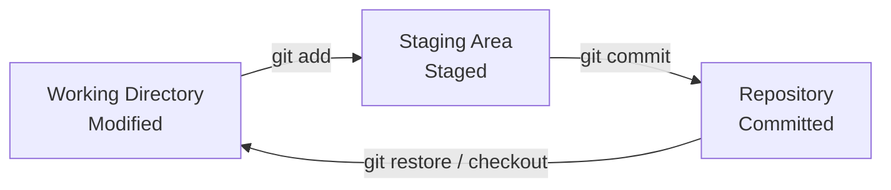
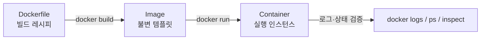
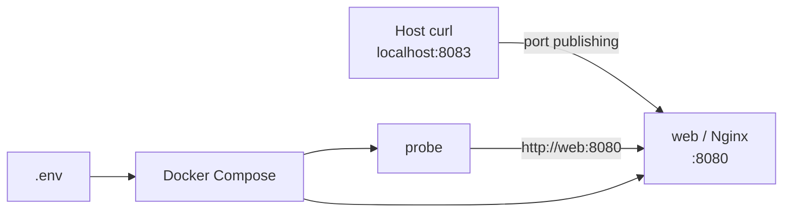
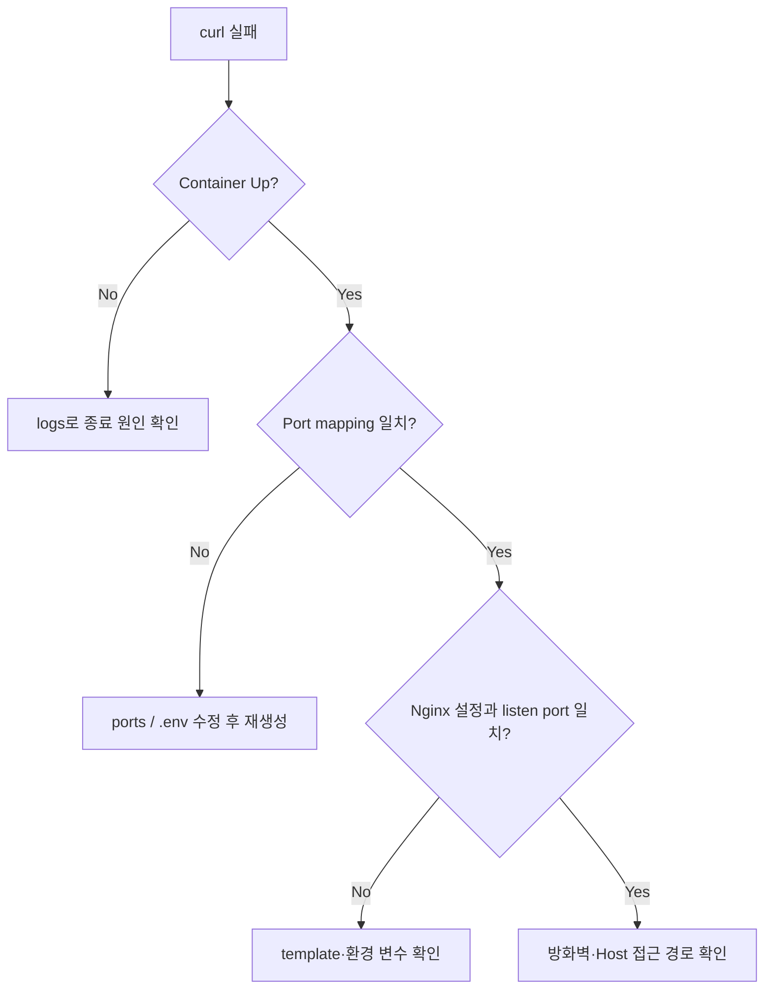

# E1-1 개발 환경 실습 가이드

이 문서는 Linux CLI, Git/GitHub, Docker, Docker Compose 실습에서 사용한 개념과 명령어, 검증 기준, 트러블슈팅 과정을 정리한 학습용 Wiki 원문입니다.

> Docker의 전체 실행 캡처 73장은 [Docker 실행 로그와 캡처](Docker-실행-로그와-캡처) 페이지에서 확인할 수 있습니다.

> 실습 이미지는 저장소의 `docs/images/`에서 관리합니다. 파일을 추가한 뒤 아래 주석 처리된 이미지 문법을 해제하면 Wiki 게시본에서도 동일한 캡처를 사용할 수 있습니다.

## 목차

1. [버전 관리와 Git](#1-버전-관리와-git)
2. [Linux CLI와 파일 권한](#2-linux-cli와-파일-권한)
3. [Docker 핵심 개념](#3-docker-핵심-개념)
4. [이미지와 컨테이너 실습](#4-이미지와-컨테이너-실습)
5. [Dockerfile과 Nginx 웹 서버](#5-dockerfile과-nginx-웹-서버)
6. [Bind Mount와 Volume](#6-bind-mount와-volume)
7. [Docker Compose](#7-docker-compose)
8. [환경 변수 기반 멀티 컨테이너](#8-환경-변수-기반-멀티-컨테이너)
9. [GitHub SSH 인증](#9-github-ssh-인증)
10. [트러블슈팅](#10-트러블슈팅)

## 1. 버전 관리와 Git

### 1.1 버전 관리 시스템

버전 관리 시스템(VCS)은 파일의 변화를 시간순으로 기록하고 특정 시점의 상태를 복원하는 도구입니다.

| 구분 | 저장 방식 | 장점 | 한계 |
| --- | --- | --- | --- |
| Local VCS | 로컬 DB에 변경 이력 저장 | 단순하고 빠름 | 장비 장애와 협업에 취약 |
| Centralized VCS | 중앙 서버가 이력을 관리 | 권한·협업 관리가 쉬움 | 중앙 서버가 단일 장애점 |
| Distributed VCS | 각 클라이언트가 전체 저장소 복제 | 오프라인 작업과 복구에 강함 | 저장소·브랜치 운용 규칙 필요 |

Git은 Distributed VCS이며 파일 차이만 나열하기보다 프로젝트의 스냅샷을 연결해 관리합니다. 객체는 해시로 식별되므로 저장된 데이터의 무결성을 확인할 수 있습니다.

### 1.2 Git의 세 가지 상태



| 상태 | 의미 | 확인 명령 |
| --- | --- | --- |
| Modified | 작업 트리에서 파일이 변경됨 | `git status` |
| Staged | 다음 커밋에 포함될 스냅샷 후보 | `git diff --staged` |
| Committed | 로컬 저장소에 스냅샷 저장 완료 | `git log` |

### 1.3 초기 설정과 저장소 연결

Git 설치 후 사용자 정보와 기본 브랜치를 설정합니다. 설정값은 나중에 변경할 수 있지만, 이미 생성된 commit의 author 정보는 자동으로 바뀌지 않습니다.

```bash
# 한 컴퓨터에서 최초 1회 설정
git config --global user.name "<name>"
git config --global user.email "<email>"
git config --global init.defaultBranch main

# 설정 확인
git config --list

# 저장소 초기화 및 첫 push
git init
git add README.md
git commit -m "first commit"
git branch -M main
git remote add origin git@github.com:yhana972/Codyssey_E1-1.git
git push -u origin main
```

| 명령 | 역할 |
| --- | --- |
| `git init` | 현재 디렉터리에 `.git` 저장소 생성 |
| `git add <path>` | 변경 내용을 Staging Area에 등록 |
| `git commit -m` | Staged snapshot을 로컬 저장소에 기록 |
| `git remote add` | 원격 저장소 별칭과 URL 등록 |
| `git push -u` | 커밋 전송 및 upstream branch 설정 |

### 1.4 Git 설치와 최초 설정 캡처

#### 운영체제별 설치

```bash
# Fedora/RHEL 계열
sudo dnf install git-all

# Ubuntu/Debian 계열
sudo apt install git-all

# macOS: Xcode Command Line Tools 설치 여부 확인
git --version

# Windows: https://git-scm.com/download/win
```

#### 사용자 정보 설정

```bash
git config --global user.name "John Doe"
git config --global user.email johndoe@example.com
git config --global init.defaultBranch main
```

> 📸 `docs/images/git/git-01-config-user.png`


#### 설정 결과 확인

```bash
git config --list
```

> 📸 `docs/images/git/git-02-config-list.png`


### 1.5 저장소 초기화와 최초 push

```bash
echo "# Codyssey_E1-1" >> README.md
git init
git add README.md
git commit -m "first commit"
git branch -M main
git remote add origin https://github.com/yhana972/Codyssey_E1-1.git
git push -u origin main
```

> 📸 `docs/images/git/git-03-initial-push.png`


## 2. Linux CLI와 파일 권한

> 📸 **목록 확인:** `docs/images/terminal/terminal-02-list-all.png`
>
> 📸 **디렉터리 권한 변경:** `docs/images/terminal/terminal-14-directory-permission.png`
>
> 📸 **파일 권한 변경:** `docs/images/terminal/terminal-15-file-permission.png`


### 2.1 경로와 파일 조작

```bash
# 현재 위치와 숨김 항목을 포함한 상세 목록
pwd
ls -al

# 생성
touch test.txt
mkdir test

# 복사: 디렉터리는 -r 필요
cp test.txt copy.txt
cp -r test copied-test

# 이동과 이름 변경은 모두 mv 사용
mv copy.txt test/
mv test.txt renamed.txt

# 내용 확인과 편집
cat renamed.txt
vim renamed.txt

# 삭제 전 경로를 반드시 재확인
rm renamed.txt
rm -r copied-test
```

| 명령/옵션 | 의미 | 주의점 |
| --- | --- | --- |
| `pwd` | 현재 디렉터리의 절대 경로 출력 | 스크립트 실행 전 위치 확인에 유용 |
| `ls -a` | 숨김 항목 포함 | `.`과 `..`도 출력 |
| `ls -l` | 권한·소유자·크기·시간 출력 | 권한 변경 전후 비교에 사용 |
| `cp -r` | 하위 항목을 재귀적으로 복사 | 대상 경로를 먼저 확인 |
| `mv` | 이동 또는 이름 변경 | 같은 이름이 있으면 덮어쓸 수 있음 |
| `rm -r` | 디렉터리를 재귀 삭제 | 휴지통을 거치지 않으므로 특히 주의 |

### 2.2 절대 경로와 상대 경로

| 경로 | 기준 | 예시 |
| --- | --- | --- |
| 절대 경로 | 파일 시스템 루트 `/` | `/Users/user/Codyssey` |
| 상대 경로 | 현재 작업 디렉터리 | `./app`, `../README.md` |
| 홈 경로 | 현재 사용자 홈 | `~/.ssh` |

```bash
cd /Users/user/Codyssey # 절대 경로
cd ./docker-web         # 현재 위치 기준
cd ..                   # 상위 디렉터리
cd -                    # 직전 작업 디렉터리
cd ~                    # 사용자 홈
```

### 2.3 파일 권한

`ls -l`의 첫 필드는 파일 종류와 `user/group/others`의 권한을 표시합니다.

```text
- rwx rwx rwx
│  │   │   └─ others
│  │   └───── group
│  └───────── user
└──────────── file type (-: file, d: directory)
```

| 권한 | 숫자 | 파일 | 디렉터리 |
| --- | ---: | --- | --- |
| `r` | 4 | 내용 읽기 | 항목 목록 읽기 |
| `w` | 2 | 내용 수정 | 항목 생성·삭제 |
| `x` | 1 | 실행 | 디렉터리 진입 |

```bash
# 디렉터리: 755 → 700
ls -ld Codyssey
chmod 700 Codyssey
ls -ld Codyssey

# 파일: 644 → 777
ls -l Codyssey/new.txt
chmod 777 Codyssey/new.txt
ls -l Codyssey/new.txt
```

> 실습에서는 `777`의 효과를 확인했지만, 실제 환경에서는 모든 사용자에게 쓰기 권한을 주므로 최소 권한 원칙에 따라 사용해야 합니다.

### 2.4 전체 실행 로그와 캡처

Notion에 기록한 실행 순서와 스크린샷 위치를 그대로 대응시킨 섹션입니다. 이미지는 저장소의 `docs/images/terminal/`에서 관리합니다.

#### 2.4.1 현재 작업 위치 확인

```bash
yhana9728258@c4r5s1 ~ % pwd
/Users/yhana9728258
```

> 📸 `docs/images/terminal/terminal-01-pwd.png`


#### 2.4.2 숨김 파일을 포함한 목록 확인

```bash
ls -a
ls -al
```

`ls -a`로 숨김 항목을 확인하고 `ls -al`로 권한, 소유자, 크기와 수정 시간을 함께 확인했습니다.

> 📸 `docs/images/terminal/terminal-02-list-all.png`


#### 2.4.3 파일 생성

```bash
touch test.txt
ls -a
```

> 📸 `docs/images/terminal/terminal-03-touch-file.png`


#### 2.4.4 디렉터리 생성

```bash
mkdir test
ls
```

> 📸 `docs/images/terminal/terminal-04-mkdir.png`


#### 2.4.5 파일 복사

```bash
cp test.txt cp_test.txt
ls
```

> 📸 `docs/images/terminal/terminal-05-copy-file.png`


#### 2.4.6 디렉터리 복사

```bash
cp -r test cp_test
ls
```

> 📸 `docs/images/terminal/terminal-06-copy-directory.png`


#### 2.4.7 파일 이동

```bash
mv cp_test.txt cp_test
cd cp_test
ls
```

> 📸 `docs/images/terminal/terminal-07-move-file.png`


#### 2.4.8 디렉터리 이동

```bash
mv cp_test ./test
cd test
ls
```

> 📸 `docs/images/terminal/terminal-08-move-directory.png`


#### 2.4.9 파일 이름 변경

```bash
mv test.txt change_name_test.txt
ls
```

> 📸 `docs/images/terminal/terminal-09-rename-file.png`


#### 2.4.10 디렉터리 이름 변경

```bash
mv test change_name_folder_test
ls
```

> 📸 `docs/images/terminal/terminal-10-rename-directory.png`


#### 2.4.11 파일 삭제

```bash
rm change_name_test.txt
ls
```

> 📸 `docs/images/terminal/terminal-11-remove-file.png`


#### 2.4.12 디렉터리 삭제

```bash
rm -r change_name_folder_test
ls
```

> 📸 `docs/images/terminal/terminal-12-remove-directory.png`


#### 2.4.13 빈 파일 생성·편집·내용 확인

```bash
touch new.txt
cat new.txt
vim new.txt
cat new.txt
# Hi, My name is NaHyeon!
```

> 📸 `docs/images/terminal/terminal-13-file-content.png`


#### 2.4.14 디렉터리 권한 변경

```bash
ls -ld Codyssey
chmod 700 Codyssey
ls -ld Codyssey
# drwxr-xr-x (755) → drwx------ (700)
```

소유자만 디렉터리를 읽고, 수정하고, 진입할 수 있도록 변경했습니다.

> 📸 `docs/images/terminal/terminal-14-directory-permission.png`


#### 2.4.15 파일 권한 변경

```bash
ls -l new.txt
chmod 777 new.txt
ls -l new.txt
# -rw-r--r-- (644) → -rwxrwxrwx (777)
```

권한 표기 변화를 확인하기 위한 실습이며 실제 운영 환경에서는 `777` 사용을 지양합니다.

> 📸 `docs/images/terminal/terminal-15-file-permission.png`


#### 2.4.16 `rm -r` 참고 자료

디렉터리는 내부 항목을 포함하므로 재귀 옵션 `-r`을 사용해야 합니다. 삭제 전 대상 경로를 반드시 확인합니다.

> 해당 항목은 별도 캡처 없이 명령어 설명으로 대체했습니다.

#### 2.4.17 파일 권한 표기 참고 자료

`r`, `w`, `x`와 숫자 권한 `4`, `2`, `1`의 대응 관계를 정리한 참고 자료입니다.

> 해당 항목은 별도 캡처 없이 위의 권한 표로 대체했습니다.

## 3. Docker 핵심 개념

Docker는 애플리케이션과 실행 의존성을 이미지로 패키징하고 격리된 컨테이너로 실행합니다.



### 3.1 Container와 VM 비교

| 항목 | Container | Virtual Machine |
| --- | --- | --- |
| 격리 단위 | 프로세스 | 전체 OS |
| 커널 | Host kernel 공유 | Guest OS kernel 포함 |
| 시작 속도 | 빠름 | 상대적으로 느림 |
| 이미지 크기 | 대체로 작음 | 대체로 큼 |
| 적합한 용도 | 서비스 패키징·배포 | OS 수준 격리·다른 커널 실행 |

### 3.2 주요 구성 요소

| 구성 요소 | 역할 |
| --- | --- |
| Dockerfile | 이미지 생성 절차를 선언 |
| Image | 실행에 필요한 파일 시스템과 메타데이터의 읽기 전용 템플릿 |
| Container | 이미지에 쓰기 계층과 실행 프로세스를 더한 인스턴스 |
| Registry | 이미지를 저장·배포하는 원격 저장소 |
| Volume | Docker가 관리하는 영속 데이터 영역 |

## 4. 이미지와 컨테이너 실습

### 4.1 설치 및 기본 동작 확인

```bash
# 도커 설치 확인 
# docker 버전 확인 명령어
docker --version
docker version
# Docker의 전체 실행 환경과 상태 정보를 확인하는 명령
docker info
```

`docker --version`은 CLI 버전을 빠르게 확인하고, `docker version`은 Client와 Server 연결을 함께 점검합니다. 


### 4.2 hello-world 이미지 pull 및 image 목록 보기

```bash
# hello-world 이미지 다운로드 
docker pull hello-world
# hello-world 이미지 사용하는 이유?
# Docker 설치와 실행 상태를 확인하기 위한 매우 작은 테스트 이미지이기 때문. 

# 다운로드한 이미지 확인 
docker docker images
```


### 4.3 hello-world 실행

```bash
# Docker Container 실행 
docker run hello-world 
# docker run 이 수행하는 작업
# 이미지 확인 -> 새 컨테이너 생성 -> 컨테이너 시작 -> 컨테이너의 기본 프로그램 실행
# 컨테이너의 기본 프로그램이란?
# 컨테이너가 켜질 때 실행되어 내부 환경을 유지하고 애플리케이션을 구동시키는 최초의 프로세스를 말함. 
```


### 4.4 실행 중인 컨테이너 확인

```bash
# 현재 실행 중인 컨테이너 확인 
docker ps
# Q. 아까 run한 hello-world Container가 보이지 않는데요?!
# A. 컨테이너는 내부의 메인 프로세스가 실행되는 동안만 유지됨. hello-world Container의 메인 프로세스는 메시지를 한 번 출력하면 끝나기 때문에 현재 실행 중인 컨테이너가 아니라서 목록에 뜨지 않음!

# 현재 실행 중인 컨테이너 뿐만이 아니라 종료된 컨테이너 까지 확인하는 명령
docker ps -a
# -a = -all 의 축약 옵션. 
# Exited(0) 의 의미 : 정상종료, 0외는 오류 또는 비정상 종료 가능성이 있음. 
```


### 4.5 컨테이너 로그 확인

```bash
docker logs hello-world
# 왜 사용?
# 컨테이너가 실행 중 출력한 내용을 다시 확인하기 위해 사용됨. 실행중인 컨테이너도 종료된 컨테이너에서도 확인 가능. 종료지 삭제된 것이 아니기 때문에 로그도 조회 가능함. 
# 여기서 중요한 점. 컨테이너 이름과 이미지는 다르기 때문에 run 할때 --name 옵션을 사용하여 이름을 지정해주거나 docker ps -a 로 컨테이너의 NAMES 를 찾아 logs를 찍어봐야함.
```


### 4.6 Ubuntu 컨테이너 생성 및 내부 진입

```bash
docker run -it --name ubuntu-lab ubuntu:24.04 bash
# 왜 사용?
# Ubuntu 24.04 이미지를 기반으로 새 컨테이너를 생성하고, 실행과 동시에 내부 Bash 셸로 연결되어 대화형 터미널을 바로 사용하기 위해 사용됨.
# 명령어 구성:
# - docker run: 이미지로 새 컨테이너를 생성하고 실행
# - -i: 키보드 입력을 받을 수 있도록 표준 입력(stdin) 유지
# - -t: 터미널처럼 사용할 수 있는 가상 TTY 할당/ 가상 TTY : 내가 키보드로 입력하고 모니터로 결과를 볼 수 있는 가상의 터미널 화면
# - --name ubuntu-lab: 컨테이너 이름 지정
# - ubuntu:24.04: 사용할 Ubuntu 이미지와 버전
# - bash: 컨테이너가 시작될 때 실행할 메인 프로그램
# 여기서 중요한 점. -i와 -t 옵션을 함께(-it) 사용해야 컨테이너 내부의 대화형 셸을 터미널 환경에서 입력/출력을 주고받으며 정상적으로 사용할 수 있음.
```


### 4.7 컨테이너 내부에서 간단한 명령 실행

```bash
pwd
ls
echo "Hello from Ubuntu container"
# 왜 사용?
# 지정한 문자열을 터미널 화면에 그대로 출력해보기 위해 사용됨. (echo 명령어 뒤에는 공백 필요)
# 예상 결과: Hello from Ubuntu container

cat /etc/os-release
# 왜 사용?
# 현재 실행 중인 리눅스 OS의 배포판 이름 및 상세 버전 정보를 확인하기 위해 사용됨.
# 예상 결과: NAME="Ubuntu", VERSION="24.04..." 등의 OS 상세 정보 출력

echo $$
# 왜 사용?
# 현재 실행 중인 셸(Bash) 프로세스의 PID(프로세스 ID 번호)를 확인하기 위해 사용됨.
# 예상 결과: 1
# 여기서 중요한 점. 컨테이너 내부에서 메인 실행 프로그램으로 bash를 지정해 진입했으므로, 해당 bash가 최상위 프로세스인 PID 1번을 부여받음.
```


### 4.8 exit했을 때 컨테이너 상태 관찰

```bash
exit
# 왜 사용?
# 컨테이너 내부 셸(Bash)을 종료하고 터미널 프롬프트를 호스트(macOS)로 되돌리기 위해 사용됨.

docker ps --filter name=ubuntu-lab
# 왜 사용?
# 현재 '실행 중(Up)'인 특정 컨테이너(ubuntu-lab)의 상태를 확인하기 위해 사용됨.
# 예상 결과: 메인 프로세스가 종료되었으므로 목록에 아무것도 나타나지 않음.

docker ps -a --filter name=ubuntu-lab
# 왜 사용?
# 종료된(Exited) 컨테이너를 포함하여 특정 컨테이너(ubuntu-lab)의 전체 상태 기록을 확인하기 위해 사용됨.
# 예상 결과: STATUS 항목에 'Exited (0)'으로 표시됨.

# 핵심 동작 원리 (컨테이너가 종료된 이유):
# 컨테이너는 PID 1번인 메인 프로세스가 유지되는 동안만 실행 상태를 유지합니다.
# [컨테이너 시작] ➔ [PID 1로 bash 실행] ➔ [exit 입력] ➔ [PID 1인 bash 종료] ➔ [컨테이너 자동 종료]
```


### 4.9 컨테이너 재시작 후 attach 실습

```bash
docker start ubuntu-lab
# 왜 사용?
# 중지(Exited) 상태인 컨테이너를 삭제하지 않고 다시 재시작(Up)하기 위해 사용됨.

docker ps --filter name=ubuntu-lab
# 왜 사용?
# 컨테이너가 정상적으로 재시작되었는지 실행 상태(Up)를 확인하기 위해 사용됨.
# 예상 결과: STATUS 항목이 'Up ...'으로 표시됨.

docker attach ubuntu-lab
# 왜 사용?
# 이미 실행 중인 컨테이너의 메인 프로세스(PID 1 번인 Bash)의 표준 입출력 스트림에 현재 터미널을 직접 연결하기 위해 사용됨.
# (참고: 새 셸을 띄우는 것이 아니라, 기존에 도커가 잡고 있던 메인 화면에 접속하는 것임)

echo "Entered with docker attach"
# 왜 사용?
# attach로 컨테이너 내부 메인 셸 접속에 성공했는지 텍스트를 출력해 확인하기 위해 사용됨.

echo $$
# 왜 사용?
# 현재 연결된 셸의 프로세스 ID(PID)를 확인하기 위해 사용됨.
# 예상 결과: 1 (기존의 메인 Bash 프로세스에 직접 연결되었음을 증명함)

# --- [컨테이너를 종료하지 않고 탈출하기: 단축키 입력] ---
# 단축키: Ctrl + P ➔ 이어서 Ctrl + Q (Enter 누르지 않음)
# 왜 사용?
# 'exit'를 치면 PID 1인 Bash가 종료되어 컨테이너도 함께 꺼지지만, 이 단축키 조합(Detach)을 사용하면 PID 1을 살려둔 채 터미널 연결만 안전하게 분리할 수 있음.

docker ps --filter name=ubuntu-lab
# 왜 사용?
# 단축키로 탈출한 후 컨테이너가 꺼지지 않고 백그라운드에서 계속 실행(Up) 중인지 최종 확인하기 위해 사용됨.
# 예상 결과: STATUS 항목이 여전히 'Up ...' 상태 유지.

# 핵심 동작 원리 (docker attach 탈출 시):
# [attach 연결 해제 (Ctrl+P, Q)] ➔ [터미널만 컨테이너에서 분리] ➔ [PID 1 Bash는 계속 실행] ➔ [컨테이너 상태 'Up' 유지]
```


### 4.10 exec로 새로운 셸 진입

```bash
docker exec -it ubuntu-lab bash
# 왜 사용?
# 이미 실행 중인 컨테이너(ubuntu-lab) 내부에서 기존 프로세스와 별개로 '새로운 Bash 셸 프로세스'를 추가로 생성하여 대화형 터미널로 진입하기 위해 사용됨.
# 명령어 구성:
# - docker exec: 실행 중인 컨테이너에서 새로운 명령을 추가로 실행
# - -i: 표준 입력(stdin) 유지
# - -t: 가상 터미널(TTY) 할당
# - ubuntu-lab: 대상 컨테이너 이름
# - bash: 컨테이너 내부에서 새로 시작할 메인 프로그램

echo "Entered with docker exec"
# 왜 사용?
# docker exec를 통해 컨테이너 내부의 새로운 셸에 정상적으로 진입했는지 확인하기 위해 사용됨.

echo $$
# 왜 사용?
# 현재 실행 중인 셸의 프로세스 ID(PID)를 확인하기 위해 사용됨.
# 예상 결과: 1이 아닌 다른 숫자 (예: 24)
# (원인: PID 1은 처음 컨테이너를 띄운 메인 Bash이고, exec로 실행한 Bash는 그 아래 자식 프로세스로 새로 생성되었기 때문)

exit
# 왜 사용?
# docker exec로 새로 들어간 추가 Bash 셸을 종료하고 호스트 터미널로 돌아오기 위해 사용됨.

docker ps --filter name=ubuntu-lab
# 왜 사용?
# exec 셸을 종료(exit)한 후에도 컨테이너가 꺼지지 않고 계속 실행 중(Up)인지 확인하기 위해 사용됨.

# 핵심 동작 원리 (docker exec 종료 시 컨테이너가 유지되는 이유):
# PID 1 메인 Bash (계속 실행 중)
# exec Bash (exit 실행 시 이 추가 프로세스만 종료됨)
# 인 프로세스(PID 1)가 살아있으므로 컨테이너는 종료되지 않고 유지됨.
```


### 4.11 attach에서 exit했을 때 다시 확인

```bash
docker attach ubuntu-lab
# 왜 사용?
# 실행 중인 ubuntu-lab 컨테이너의 메인 프로세스(PID 1인 Bash) 화면에 다시 직접 연결(입출력 스트림 접속)하기 위해 사용됨.

exit
# 왜 사용?
# 현재 연결되어 있는 셸(Bash)을 종료하기 위해 사용됨.
# (주의: attach로 접속한 상태에서 exit를 입력하면 컨테이너의 메인 프로세스 자체가 종료됨)

docker ps -a --filter name=ubuntu-lab
# 왜 사용?
# 컨테이너의 최신 상태를 조회하여 정상적으로 종료(Exited)되었는지 확인하기 위해 사용됨.
# 예상 결과: STATUS 항목에 'Exited (0)'으로 표시됨.

# 핵심 동작 원리 (attach 접속 후 exit 시 컨테이너가 종료되는 이유):
# docker attach는 새로운 셸을 만든 것이 아니라 '컨테이너의 메인 프로세스(PID 1 Bash)'에 직접 연결된 상태입니다.
# 따라서 exit 명령어로 그 Bash를 종료하는 순간, 컨테이너를 유지하던 PID 1 프로세스가 사라지므로 컨테이너 전체가 함께 종료(Exited)됩니다.

```


## 5. Dockerfile과 Nginx 웹 서버

### 5.1 Dockerfile

저장소의 `docker-web/Dockerfile`은 다음 구조입니다.

```dockerfile
# Dockerfile 안에 내용 
FROM nginx:alpine 
# 왜 사용?
# 이미 웹 서버 기능이 설치된 Nginx 이미지 기반으로 시작하기 위해. 처음부터 Linux를 설치하고 Nginx 패키지를 설치하고 설정하는 대신 이미 구성된 공식 이미지를 재사용! 
# alpine? Alpine Linux 기반의 Nginx 이미지 변형을 의미

LABEL org.opencontainers.image.title="codyssey-web"
LABEL org.opencontainers.image.description="Codyssey Docker workstation web server"
# 왜 사용?
# 이미지에 제목과 설명 같은 메타데이터를 추가하기 위해 사용. 
# 메타데이터 : 데이터를 설명하기 위한 데이터

COPY app/ /usr/share/nginx/html/
# 왜 사용?
# 호스트 컴퓨터의 app 폴더에 있는 웹 소스코드를 Docker 이미지 내부로 복사하기 위해 사용.
# -> Nginx는 기본적으로 이미지 내부의 /usr/share/nginx/html에 있는 파일을 웹 콘텐츠로 제공.
# 그래서 복사한 내용의 소스코드가 실행됨. 
# 중요한점 : COPY는 컨테이너 실행 시점이 아니고 이미지 빌드 시점에 이루어짐. 빌드 후 html 수정해도 이미지에 자동 반영되지 않음. 변경 사항을 이미지에 적용하려면 다시 빌드해야함. 

EXPOSE 80
# 왜 사용?
# 컨테이너가 80번 포트를 사용한다고 명시해줌. 포트를 실제로 호스트에 공개하는 명령이 아니고 이미지가 사용할 포트를 설명하는 설정임. 
```

### 5.2 Build, Run, Verify

```bash
docker build -t codyssey-web:1.0 .
# 왜 사용?
# 작성한 Dockerfile을 읽어 실제 실행 가능한 Docker 이미지를 만들기 위해 사용
# -t codyssey-web:1.0 (-t : 이름과 태그 지정 옵션)
# 이미지 이름 : codyssey-web, 태그 : 1.0 (이미지의 버전이나 용도를 구분할 때 사용)
# . : 현재 디렉토리를 빌드 컨텍스트로 사용한다는 뜻 
docker images codyssey-web
# 왜 사용?
# 실제로 로컬 이미지 저장소에 결과물이 만들어졌는지 확인하기 위해 사용

docker run -d --name codyssey-web -p 8080:80 codyssey-web:1.0
# 왜 사용?
# build 한 건 실행 전 템플릿인 이미지임. run 명령어로 실제 동작하는 컨테이너 생성하고 실행. 
# 도커 이미지와 도커 컨테이너의 차이?
# 이미지 : 어플리케이션을 실행하기 위한 설계도.
# 컨테이너 : 설계도를 바탕으로 만들어진 실체. 
# -d : detached 모드, 컨테이너를 백그라운드에서 사용. 터미널을 계속 사용하기 위해! 
# --name : 컨테이너 이름 지정해줌. 나중에 관리가 편리하
# -p 8080:80 : 호스트 8080 포트와 컨테이너 내부 80 포트를 연결해줌.
```


## 6. Bind Mount와 Volume

### 6.1 비교
```bash
# ==============================================================================
# 바인드 마운트 (Bind Mount) vs 도커 볼륨 (Docker Volume) 완벽 정리
# ==============================================================================

# 1. 바인드 마운트 (Bind Mount)
# - 핵심 역할: 호스트(내 컴퓨터)의 특정 파일/폴더와 컨테이너 내부 경로를 1:1 실시간 연동
# - 왜 사용? 
#   소스 코드 수정 후 'docker build'를 매번 하지 않고, 저장(Ctrl+S) 즉시 컨테이너에 반영하기 위함 (핫 리로딩)
# - 실무 활용: 웹 애플리케이션 소스 코드 개발 (app/, src/ 폴더 등)
# - 예시 명령어:
docker run -d -p 8080:80 -v $(pwd)/src:/app/src --name my-web-dev nginx

# 2. 도커 볼륨 (Docker Volume)
# - 핵심 역할: 도커가 전용 공간(/var/lib/docker/volumes/...)에서 직접 관리하는 독립적인 데이터 저장소
# - 왜 사용? 
#   컨테이너가 삭제되어도 DB 데이터, 사용자 업로드 파일 등의 유실을 막고, OS 구분 없이 최고의 I/O 성능과 보안성을 확보하기 위함
# - 실무 활용: 데이터베이스(MySQL, PostgreSQL 등), 인프라 영속 데이터
# - 예시 명령어:
docker volume create db-data
docker run -d -p 3306:3306 -v db-data:/var/lib/mysql --name my-db mysql:8.0

# 핵심 요약 (마운트/볼륨을 사용하는 근본적인 이유)
# "컨테이너는 언제든 지우고 다시 켤 수 있는 '소모품'으로 다루고, 중요한 데이터는 외부에 안전하게 격리 보관하기 위함"

# 3. 실무에서의 조합: 도커 컴포즈 (Docker Compose)
# - 소스 코드는 '바인드 마운트'로 실시간 개발하고, DB는 '볼륨'으로 안전하게 보호하는 환경을 
#   yaml 파일 하나에 정의하여 명령어 한 줄(`docker compose up`)로 일괄 관리함.
```

### 6.2 Bind Mount

```bash
# 1. 바인드 마운트 컨테이너 실행
docker run -d --name bind-web -p 8081:80 --mount "type=bind,source=$(pwd)/app,target=/usr/share/nginx/html,readonly" codyssey-web:1.0
# 왜 사용?
# 호스트의 app 폴더를 실행 중인 컨테이너의 웹 콘텐츠 경로에 연결하기 위함. 
# --mount type=bind,source=<호스트 경로>,target=<컨테이너 경로> 형식을 사용
# source=$(pwd)/app : 호스트에 연결할 원본 폴더. $(pwd)는 현재 절대 경로로 변환됨. 
# target=/usr/share/nginx/html : 호스트 폴더를 연결할 컨테이너 내부 경로
# readonly : 파일을 읽을 수는 있지만 수정하지 못하게 함. 

# 2. 실행 상태와 마운트 확인
docker ps --filter name=bind-web
# --filter name= : bind-web이 포함된 모든 컨테이너를 찾음. 

# 3. 호스트 변경 전 상태 확인
# 일단! 왜 컨테이너 호스트에서 마운트 호스트로 변경하는 이유
# 도커 컨테이너에게 너 이제 너꺼 쓰지 말고 내꺼 특정 폴더 보고 있어라 라고 말해주는 것임. 
# 컨테이너 내부 폴더를 독립적 사용하지 말고 내 로컬에 있는 폴더로 교체해서 사용해라.

# 컨테이너에게 bind-test.txt 파일의 내용을 보여달라고 요청하는 명령어. 
# curl : Client URL, URL에 데이터를 보내거나 받아오는 파일 전송 도구. 
# -i : include의 약자. 서버 상태를 알려주는 HTTP 응답 헤더 정보도 화면에 표시하라는 뜻.
curl -i http://localhost:8081/bind-test.txt
# 왜 먼저 404를 확인?
# 내가 지정한 마운트 호스트 폴더가 도커 컨테이너와 제대로 연결되었는지 눈으로 검증하기 위한 테스트. 겸사 겸사 변경 전에 해당 파일이 존재하지 않았다는 증거를 남기기 위함. 

# 4. 호스트에 파일 생성
yhana9728258@c4r10s2 docker-web % touch ./app/bind-test.txt
yhana9728258@c4r10s2 docker-web % vim ./app/bind-test.txt
yhana9728258@c4r10s2 docker-web % cat ./app/bind-test.txt
바인드 마운드 업데이트 성공! 

# 5. 호스트 변경 후 웹 서버 응답 확인
# 아래 명령어로 변경이 잘 되었는지 확인. 
curl -i http://localhost:8081/bind-test.txt
# 그래서 뭐가 증명..?
# 호스트 폴더와 컨테이너 폴더가 직접 연결되어 있기 때문에 build, restart, rm/run 명령어를 치지 않아도 즉시 컨테이너 안에 보인것임. 
```


### 6.3 Volume과 영속성 검증

```bash
# 1. 도커 볼륨 생성
# codyssey-data 라는 이름의 volume 생성
docker volume create codyssey-data
# volume 생성 결과 확인 
docker volume ls --filter name=codyssey-data
```


```bash
# 2. 컨테이너에 볼륨 연결
# 바인드 마운트 포트에 볼륨을 연결해주기 위해 일단 마운트 호스트 중지
docker stop bind-web
# 중지 확인
docker ps
# 바인드 마운트 포트에 볼륨 연결
docker run -d \
  --name  \
  -p 8081:80 \
  --mount type=volume,source=codyssey-data,target=/usr/share/nginx/html/data \
  codyssey-web:1.0
# 연결이 잘 됐나 확인. 
docker ps --filter name=codyssey-data

# 여기서 막혔던 점. Compose로 관리 해준다고 생각해서 bind-web라는 이미 만들어진 컨테이너에 볼륨을 추가하려고 했었음. 이미 만들어진 컨테이너에 새롭게 볼륨을 추가 할 수 없음. 이미 생성된 컨테이너에는 새 볼륨이나 포트 매핑을 할 수 없음. 그래서 새 컨테이너로 포트 매핑해야함. 여기서 또 문제, 내부 포트 80번을 같이 사용하는 것은 가능하나 호스트 포트 8081 을 같이 사용할 수 없음. 이유 : 두 컨테이너가 같은 호스트 포트를 점유하려 해서 충돌남. 둘을 동시에 실행하려면 호스트 포트를 다르게 설정해야함. 
# 그래서 새 컨테이너의 새로운 호스트 포트로 테스트를 진행하려고 함. 나중에 Compose 할 때 같은 컨테이너 안에 바인드 마운트와 볼륨은 두기로 하겠음.

# 새 컨테이너 생성 및 볼륨 연결
docker run -d \
  --name volume-web-1 \
  -p 8082:80 \
  --mount type=volume,source=codyssey-data,target=/usr/share/nginx/html/data \
  codyssey-web:1.0
  
# --name volume-web-1 : 새 컨테이너 이름
# -p 8082:80 : 호스트 8082번 요청을 컨테이너의 80번 포트로 전달
# type=volume : Docker 관리 볼륨 사용
# source=codyssey-data : 연결할 기존 볼륨 이름
# target=/usr/share/nginx/html/data : 컨테이너 내부에서 볼륨이 보일 경로
# codyssey-web:1.0 : 컨테이너 생성에 사용할 커스텀 이미지

# 컨테이너 실행 확인 
docker ps --filter name=volume-web-1
```


```bash
# 3. 볼륨에 데이터 생성
docker exec volume-web-1 sh -c 'echo "Persistent data created by volume-web-1" > /usr/share/nginx/html/data/result.txt'
# 데이터 확인
docker exec volume-web-1 \
  cat /usr/share/nginx/html/data/result.txt

#4. 컨테이너 삭제
docker rm -f volume-web-1
#rm : 삭제 명령
#-f : 실행 중인 컨테이너를 강제로 종료한 뒤 삭제 

#5. 컨테이너 삭제 후 볼륨이 남았는지 확인
docker volume ls --filter name=codyssey-data

#6. 동일한 볼륨을 새 컨테이너에 연결 및 실행 상태 확인.
docker run -d \
  --name volume-web-2 \
  -p 8082:80 \
  --mount type=volume,source=codyssey-data,target=/usr/share/nginx/html/data \
  codyssey-web:1.0

#7. 새 컨테이너에 기존 데이터 있는지 확인. 
docker exec volume-web-2 cat /usr/share/nginx/html/data/result.txt
# docker exec : 이미 실행 중인 컨테이너 내부에서 추가 명령 실행
```


## 7. Docker Compose

### 7.1 단일 Compose 웹 서비스 설정

```bash
# 1. 기존 커스텀 이미지 확인
docker images codyssey-web

# 왜 사용해요?
# Compose 파일에 새 이미지를 빌드하지 않고 기존에 만든 codyssey-web:1.0 이미지를 사용하기 위함. 
# 로컬에 이미지가 존재하는지 사전 확인하는 작업.
```


```bash
# 2. 단일 서비스 Compose 파일 작성
dvim compose.single.yaml
# Compose가 기본으로 찾는 파일명 : compose.yaml, docker-compose.yaml
# 근데 왜 이름이 다른가? 이번 실습 이후에 만들 멀티 컨테이너용 compose.yaml과 이름을 구분하기 위함. 
# 기본 이름이 아닌 파일을 실행 할때 -f 옵션으로 파일을 직접 지정할 예정.
# Compose CLI의 -f, --file 옵션은 사용할 Compose 설정 파일의 이름과 경로를 지정

# YAML 파일 작성 이유(일회성 명령에서 문서화된 실행 설정으로 바뀌는 이유) : 사람의 기억과 터미널 입력에 의존하던 방식으로 코드 형태로 기록하여 자동화 하고 협업을 원활하게 하기 위함. 
```


```yaml
# Compose 파일을 최상위 services 아래에 실행할 서비스를 선언함. 
# 각 서비스 이름 아래에는 사용할 이미지, 포트, 볼륨, 환경 변수 등의 실행 조건을 작성. 

# name : compose 프로젝트의 이름을 지정. 컴포즈는 여러 서비스를 하나의 프로젝트 단위로 묶어관리함. 이름이 이후 compose가 생성하는 컨테이너와 네트워크 이름에 사용될 수 있음. 
# 예상 컨테이너 이름 : codyssey-compose-single-web-1 
# 구조 : 프로젝트이름(codyssye-compose-single)-서비스이름(web)-컨테이너번호(1) 
name: codyssey-compose-single

#services : compose가 관리할 애플리케이션 서비스들을 정의하는 최상위 항목. 서비스는 하나의 컨테이너 실행 단위를 의미. 
services:
#web : 서비스 이름. 커스텀 가능. Docker 이미지 이름이나 컨테이너 이름이 아님. Compose내부에서 사용하는 서비스 식별자. 
  web: 
  #image: web 서비스를 생성할 때 사용할 Docker 이미지를 지정. 
    image: codyssey-web:1.0 # 이미지
    #ports : 호스트 포트:컨테이너포트
    ports: 
	    # - : YAML 목록의 한 항목이라는 뜻. 여러 포트를 연결할 수 있음.
	    # 예시 : 
			# ports:
			#.  - "8083:80"
			#.  - "8443:443"
      - "8083:80"
```
```bash
# 3. Compose 설정 검증
docker compose -f compose.single.yaml config
# 왜 사용? : 컨테이너를 실제로 생성하기 전 아래 내용 확인용.
# - YAML 문법이 올바른지
# - Compose가 서비스 설정을 정상적으로 해석하는지
# - 이미지와 포트 설정이 원하는 구조로 적용되는지
# - 상대 경로나 환경 변수가 어떻게 해석되는 
# docker compose config 명령어는 설정을 확인 할 뿐 컨테이너를 생성하거나 실행하지 않음. 
```


### 7.2 단일 서비스 실행 및 상태 확인
```bash
# 1. 단일 서비스 실행
docker compose -f compose.single.yaml up -d
# 왜 사용? compose.single.yaml에 기록한 설정을 Docker 환경에 적용하기 위함. 
# Compose가 현재 파일을 읽고 다음 작업 수행.
# 이미지 확인, Compose 프로젝트 전용 네트워크 생성, web 서비스용 컨테이너 생성, 호스트 포트와 컨테이너 포트 연결, 컨테이너 시작
# Compose는 별도 네트워크 설정이 없으면 프로젝트용 기본 네트워크 자동으로 생성. 일반적으로 네트워크 이름은 <프로젝트명>_default 임.

# up : 서비스에 필요한 컨테이너와 네트워크를 생성하고 시작함.

# -d : detached 모드로 백그라운드에서 실행함. 
# 사용 이유 : -d없으면 로그가 현재 터미널에 계속 출력됨. 
```


```bash
# 2. Compose 서비스 상태 확인
docker compose -f compose.single.yaml ps
# 왜 사용? : Compose가 관리하는 컨테이너가 정상적으로 실행 중인지 확인하기 위함. 
# docker compose ps는 해당 프로젝트의 컨테이너 이름, 이미지, 서비스, 상태 및 공개된 포트를 보여줌.
```


```bash
# 3. Compose 네트워크 생성 확인
docker network inspect codyssey-compose-single_default
# 왜 사용? : 생성된 네트워크에 실제로 web 컨테이너가 연결 되어 있는지 확인하기 위함.
# docker network ls : 네트워크 존재 여부만 보여줌.
# docker network inspect : 세부 정보를 보여줌.
# 보여주는 세부 정보 : 네트워크 이름, 네트워크 드라이버, IP 대역, 게이트웨이, 연결된 컨테이너, 컨테이너 내부 IP  

# 출력 내용 중 Container 부분에 name이 codyssey-compose-single-web-1로 되어있음.
# 기본 네트워크에 연결 되었다는 것을 확인 할 수 있음. 
```


```bash
# 4.  웹 서버 응답 확인
curl -i http://localhost:8083

# 왜 사용? :  컨테이너가 Up 상태라는 것만으론 웹이 정상 응답한다고 확정할 순 없음. 실제로 HTTP 요청을 보내 전체 흐름 확인. 
# 컨테이너 Up 상태 만으로 정상 확정 할 수 없는 이
# 1. 프로세스는 살아있어서 도커는 올라갔지만 HTTP 요청시 어플리케이션 내부문제로 응답 없음이 뜰 수 잇음.
# 2. 컨테이너 내부에서는 웹서가 잘돌고 있지만 외부 접속 시도시 연결 거부 될 수도 있음(포트 바인딩/매핑 오류)
# 전체 흐름 : curl -> localhost:8083 -> host 8083 port -> container 80 port -> Nginx -> index.html response. 
```


```bash 
## 5. 웹 서버 로그 확인
docker compose -f compose.single.yaml logs web 
# 왜 사용해요? 
# curl 또는 브라우저 요청이 실제로 Nginx 컨테이너까지 전달되었는지 로그로 확인하기 위함. 
# docker compose logs : Compose 서비스가 출력한 로그를 조회하는 명령어. 
# -f compose.single.yaml : 사용할 Compose 파일을 직접 지정함. 기본 파일명인 compose.yaml이 아니므로 -f 옵션이 필요함. 
# web : compose.single.yaml에 정의한 web 서비스의 로그만 조회함. 

# 최근 로그만 확인 
docker compose -f compose.single.yaml logs --tail=20 web 
# 왜 사용해요? 
# 로그가 많아졌을 때 전체 로그가 아닌 최근 로그 20줄만 확인하기 위함. 
# --tail=20 : 로그의 마지막 20줄만 출력함. 
# 실시간 로그 확인 
docker compose -f compose.single.yaml logs -f web 
# 왜 사용해요? 
# 브라우저 새로고침이나 curl 요청이 발생할 때 새로운 로그가 실시간으로 출력되는 것을 확인하기 위함. 
# -f : --follow의 약자. 새로운 로그가 발생할 때마다 계속해서 출력함.
``` 


```bash 
## 6. Compose 서비스 종료 및 삭제
docker compose -f compose.single.yaml down 
# 왜 사용해요? 
# compose.single.yaml로 생성한 컨테이너와 네트워크를 한 번에 정리하기 위함. 
# down : 실행 중인 서비스 컨테이너를 중지한 후 삭제함. Compose가 생성한 기본 네트워크도 삭제함. 
# 기본적으로 삭제되는 리소스 
# - codyssey-compose-single-web-1 컨테이너 
# - codyssey-compose-single_default 네트워크 
# Docker 이미지와 compose.single.yaml 파일은 삭제되지 않음. 
# Named Volume도 기본적으로 삭제되지 않음. 
``` 


## 8. 환경 변수 기반 멀티 컨테이너

### 8.1 구성 흐름



### 8.2 `.env`와 `.env.example`

```dotenv
HOST_PORT=8083
CONTAINER_PORT=8080
APP_MODE=development
```

`.env`는 실제 실행값을 담고 `.env.example`은 필요한 변수 이름과 예시값을 공유합니다. 비밀번호나 API key가 포함될 수 있는 `.env`는 `.gitignore`에서 제외해야 합니다.

```gitignore
**/.env
```

### 8.3 Nginx template

```nginx
server {
    listen ${NGINX_PORT};
    server_name _;

    root /usr/share/nginx/html;
    index index.html;

    add_header X-App-Mode "${APP_MODE}" always;

    location / {
        try_files $uri $uri/ =404;
    }
}
```

Nginx image의 template 처리 과정이 `${NGINX_PORT}`와 `${APP_MODE}`를 실제 값으로 치환합니다. `NGINX_ENVSUBST_FILTER`를 지정하면 Nginx 자체 변수인 `$uri`가 잘못 치환되는 것을 방지할 수 있습니다.

### 8.4 Compose 멀티 서비스 예시

```yaml
name: codyssey-compose-multi

services:
  web:
    image: codyssey-web:1.0
    ports:
      - "${HOST_PORT}:${CONTAINER_PORT}"
    environment:
      NGINX_PORT: "${CONTAINER_PORT}"
      APP_MODE: "${APP_MODE}"
      NGINX_ENVSUBST_FILTER: "^(NGINX_PORT|APP_MODE)$"

  probe:
    image: alpine:latest
    command: ["sh", "-c", "sleep infinity"]
    environment:
      APP_MODE: "${APP_MODE}"
      WEB_URL: "http://web:${CONTAINER_PORT}"
    depends_on:
      - web
```

Compose의 기본 network에서는 service name이 DNS 이름으로 동작합니다. 따라서 `probe`는 변경될 수 있는 Container IP 대신 안정적인 이름 `web`을 사용합니다.

### 8.5 설정·실행·통신 검증

> 📸 **서비스 디스커버리와 통신:** `docs/images/docker/docker-65-interservice-http.png`


```bash
# 실행 전 설정 검증
docker compose config --environment
docker compose config
docker compose config --services

# 실행과 상태 확인
docker compose up -d
docker compose ps
docker network inspect codyssey-compose-multi_default

# 환경 변수와 생성된 Nginx 설정 확인
docker compose exec web printenv NGINX_PORT APP_MODE NGINX_ENVSUBST_FILTER
docker compose exec probe printenv APP_MODE WEB_URL
docker compose exec web cat /etc/nginx/conf.d/default.conf

# Host → web
curl -i http://localhost:8083

# probe → Docker DNS → web
docker compose exec probe nslookup web
docker compose exec probe sh -c \
  'echo "APP_MODE=$APP_MODE"; echo "WEB_URL=$WEB_URL"; wget -qO- "$WEB_URL"'

docker compose logs --tail=20 web
```

### 8.6 `.env` 변경 검증

> 📸 **환경 변수 변경 전·후:** `docs/images/docker/docker-72-new-port-success.png`


| 항목 | 변경 전 | 변경 후 |
| --- | --- | --- |
| `HOST_PORT` | `8083` | `8084` |
| `CONTAINER_PORT` | `8080` | `9090` |
| `APP_MODE` | `development` | `production` |
| HTML / Image | 변경 없음 | 변경 없음 |

```bash
docker compose config --environment
docker compose up -d --force-recreate
docker compose ps

# 이전 Host port는 실패해야 함
curl -i http://localhost:8083

# 새 Host port와 mode 검증
curl -i http://localhost:8084
docker compose exec web printenv NGINX_PORT APP_MODE
docker compose exec probe printenv APP_MODE WEB_URL
docker compose exec probe wget -qO- "$WEB_URL"

docker stats --no-stream
docker compose down
docker compose ps -a
docker network ls --filter name=codyssey-compose-multi
```

기대 결과는 새 포트에서 `HTTP/1.1 200 OK`, `X-App-Mode: production`, 그리고 `probe → http://web:9090` 요청 성공입니다. `down` 이후에는 서비스 Container와 기본 network가 조회되지 않아야 합니다.

## 9. GitHub SSH 인증

### 9.1 기존 키 확인과 생성

```bash
ls -al ~/.ssh

# 기존 키를 덮어쓰지 않도록 파일명을 먼저 확인
ssh-keygen -t ed25519 -C "github-email@example.com"
```

개인키 `id_ed25519`는 절대 공유하거나 저장소에 commit하지 않습니다. GitHub에는 공개키 `id_ed25519.pub`만 등록합니다.

### 9.2 macOS SSH Agent 설정

```bash
eval "$(ssh-agent -s)"
touch ~/.ssh/config
```

```sshconfig
Host github.com
  AddKeysToAgent yes
  UseKeychain yes
  IdentityFile ~/.ssh/id_ed25519
```

```bash
ssh-add --apple-use-keychain ~/.ssh/id_ed25519
pbcopy < ~/.ssh/id_ed25519.pub
```

GitHub의 **Settings → SSH and GPG keys → New SSH key**에서 공개키를 등록합니다.

### 9.3 연결과 Remote URL 검증

```bash
ssh -T git@github.com
git remote -v

# HTTPS remote를 SSH로 변경할 때
git remote set-url origin git@github.com:yhana972/Codyssey_E1-1.git
git remote -v
```

성공 시 GitHub는 인증 성공과 shell access를 제공하지 않는다는 안내를 출력합니다. 이는 정상 동작입니다.

### 9.4 SSH 전환과 성공 캡처

#### Remote URL 변경 전·후

```bash
git remote -v
git remote set-url origin git@github.com:yhana972/Codyssey_E1-1.git
git remote -v
```

> 📸 `docs/images/git/git-04-remote-https-to-ssh.png`


#### GitHub SSH 인증 성공

```bash
ssh -T git@github.com
```

> 📸 `docs/images/git/git-05-ssh-auth-success.png`


#### SSH 방식 push 성공

```bash
git push -u origin main
```

> 📸 `docs/images/git/git-06-ssh-push-success.png`


## 10. 트러블슈팅

> 📸 **선택 — 대표 오류와 해결:** `docs/images/11-troubleshooting.png`

<!--  -->

### 10.1 Local image인데 pull access denied 발생

**증상**

```text
docker: Error response from daemon: pull access denied for codyssey-web,
repository does not exist or may require 'docker login'
```

**원인**

이미지를 `codyssey-web:1.o`로 빌드했지만 `codyssey-web:1.0`으로 실행했습니다. Local에 정확한 tag가 없으므로 Docker가 Registry에서 이미지를 pull하려고 시도했습니다.

**해결**

```bash
docker images codyssey-web
docker build -t codyssey-web:1.0 ./docker-web
docker run --name codyssey-web codyssey-web:1.0
```

### 10.2 `docker logs` 대상 이름 혼동

**문제:** Image name을 전달해 로그 조회에 실패했습니다.

**원인:** 로그는 Image가 아니라 Container instance에 속합니다.

**해결:** `docker ps -a`의 `NAMES`를 사용하거나 생성 시 `--name`을 지정합니다.

```bash
docker ps -a
docker logs <container-name>
```

### 10.3 기존 Container에 Volume이나 Port 추가 불가

Container 생성 옵션인 mount와 port publishing은 생성 후 직접 변경할 수 없습니다.

```bash
docker stop bind-web
docker rm bind-web

docker run -d \
  --name volume-web-1 \
  -p 8082:80 \
  --mount type=volume,source=codyssey-data,target=/usr/share/nginx/html/data \
  codyssey-web:1.0
```

### 10.4 Host port 충돌

**증상:** `port is already allocated` 또는 bind 실패

**원인:** Host의 동일한 IP/port 조합은 동시에 두 Container가 점유할 수 없습니다. Container 내부 port `80`은 서로 격리되어 같아도 됩니다.

**해결:** 각 Container의 Host port를 `8081`, `8082`처럼 다르게 게시합니다.

```text
Host :8081 → bind-web   :80
Host :8082 → volume-web :80
```

### 10.5 `.env` 변경값 미반영

**문제:** 파일을 수정했지만 기존 Container의 port와 environment가 유지됩니다.

**원인:** `.env`는 실행 중인 Container를 자동으로 변경하지 않습니다.

**해결:** 해석 결과를 먼저 확인하고 Container를 재생성합니다.

```bash
docker compose config --environment
docker compose config
docker compose up -d --force-recreate
docker compose ps
```

### 10.6 Container는 Up인데 웹 요청 실패

다음 순서로 범위를 좁힙니다.

```bash
# 1. 상태와 port mapping
docker compose ps

# 2. 최근 application log
docker compose logs --tail=50 web

# 3. 생성된 Nginx 설정
docker compose exec web cat /etc/nginx/conf.d/default.conf

# 4. Container 내부 listen port와 환경 변수
docker compose exec web printenv NGINX_PORT APP_MODE

# 5. Host의 실제 HTTP 요청
curl -i http://localhost:8084
```



## 참고 자료

- [Pro Git](https://git-scm.com/book/ko/v2)
- [GitHub Docs: SSH로 연결](https://docs.github.com/ko/authentication/connecting-to-github-with-ssh)
- [Docker Docs: Get started](https://docs.docker.com/get-started/)
- [Docker Docs: Storage](https://docs.docker.com/engine/storage/)
- [Docker Docs: Compose](https://docs.docker.com/compose/)
